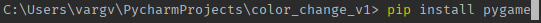
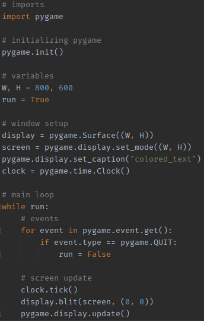
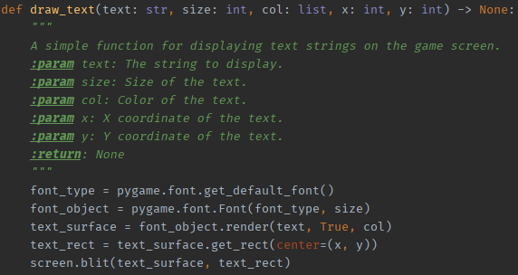
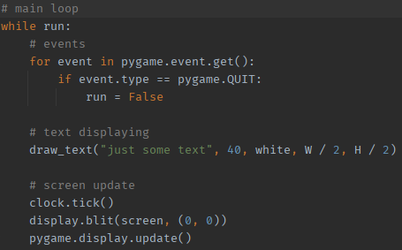
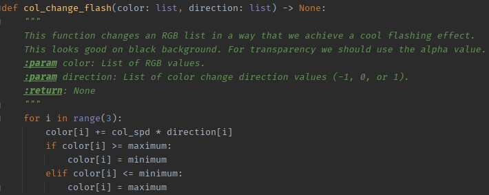
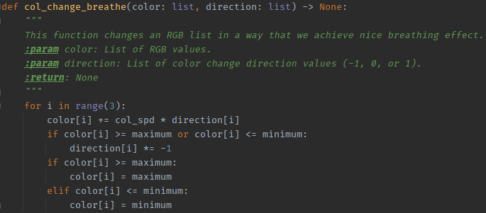
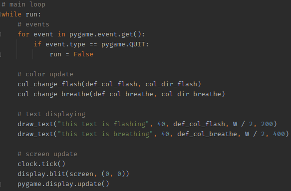
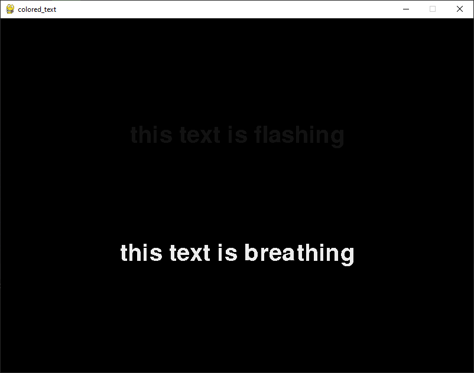

Color-changing Text in Pygame
=====================
Written documentation for my Youtube tutorial video I made back in 2021. I'll make a new video once I have the time.
I also plan making a downloadable library so anyone can use this effect in less than a minute.

---
---

First steps
=====================
All you need to do first is simply install Pygame, if you haven't done it already.
On Windows, just open your terminal (Win+R -> cmd) and type "pip install pygame"

---
---

Window setup
=====================
This is not a 101 Pygame tutorial, so I won't get into details now. 
The following is probably the most easiest way to set up a window in with Pygame.

---
---

Text displaying
=====================
The easiest way to print some text to the screen is to use the built-in font of Pygame.
When rendering it (row 3 of the function), you can set the second argument (antialiasing) to False, if the edges look bad.

Don't forget to call the function in the run loop!

---
---

Flashing function
=====================
In this function we lower (or increase) the color values of the RGB list we add as "def_col".
Note that this function won't make your text transparent, it just reduces the values until the color is black.
When we reach minimum (or either maximum) the function sets back the value to the maximum (or either minimum).

---
---

Breathing function
=====================
Works pretty much almost the same like the flashing function, the difference is that when we reach a limit, either the minimum or maximum value, we switch the color change direction by multiplying it with -1.

---
---

Results
=====================
When we call these functions like below, we get the same results that I showed in my tutorial video.

It's hard to see the result as an image, but I put it here anyways.

---
---

Notes
=====================
I did this documentation on demand. I hope this helps some of you as my tutorial is kinda outdated and entry level with lots of mistakes.
I learned a lot in these years, and I'll come up with better and more handy solutions and tutorials soon.

I also changed some variable names, they alter a bit from the video, but makes more sense. You can notice type hints and docstrings too in the functions for the sake of better comprehension.

Good luck, keep creating!
> Adrian from Ork Slayer Gamedev
---
---